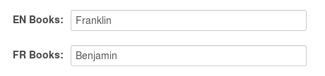
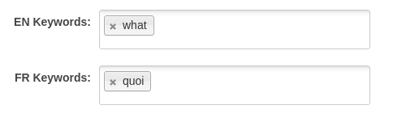

# ckanext-fluent

This extension provides a way to store and return multilingual
fields in CKAN datasets, resources, organizations and groups.

The [ckanext-scheming](https://github.com/ckan/ckanext-scheming)
extension is required for this extension to work.

## Installation

```
git clone https://github.com/ckan/ckanext-fluent.git
cd ckanext-fluent
python setup.py develop
pip install -r requirements.txt
```

Add the `fluent` plugin to your ckan.plugins configuration
settings and use ckanext-scheming or a custom form plugin to
use the provided validators to store multilingual text in
extra fields.

The easiest way to use fluent multilingual text fields is with
[ckanext-scheming](https://github.com/open-data/ckanext-scheming/).
Add `ckanext.fluent:presets.json` to your scheming.presets
configuration settings:

```json
scheming.presets = ckanext.scheming:presets.json
                   ckanext.fluent:presets.json
```

## `fluent_text` fields

A fluent multilingual text field in a scheming schema:

```json
{
  "field_name": "books",
  "preset": "fluent_text",
  "label": {
    "en": "Books",
    "fr": "Livres"
  },
  "form_languages": ["en", "fr"]
}
```

This new extra field "books" will appear as multiple fields in the
dataset form, one for each language specified in `form_languages`.



When the dataset is accessed from the API the language values appear
and are updated as an object, eg.:

```json
{
  "...": "...",
  "books": {
    "en": "Franklin",
    "fr": "Benjamin"
  },
  "...": "..."
}
```

## `fluent_tags` fields

Example multilingual tag field:

```json
{
  "field_name": "keywords",
  "label": {
    "en": "Keywords",
    "fr": "Mots-clés",
  },
  "preset": "fluent_tags"
}
```

Note: this preset is not supported for use on the core `tags` field.

This new extra field "keywords" will appear as multiple fields in the
dataset form, one for each language specified in `form_languages`.



When the dataset is accessed from the API the language values appear
and are updated as an object with list values, eg.:

```json
{
  "...": "...",
  "keywords": {
    "en": ["what"],
    "fr": ["quoi"]
  },
  "...": "..."
}
```

## `fluent_core_translated` fields

Fluent should not be directly used on ckan core fields such as `title` and `notes`.
To use fluent to translate core fields, you should use a field with the `_translated`
suffix appended to the core field name (e.g. `title_translated`) and use the `fluent_core_translated`
preset. By doing so, the translated version of the field is stored in the field with the
`_translated` suffix while the core field displays the value for the site's default language.

```json

{
  "field_name": "title_translated",
  "preset": "fluent_core_translated",
  "label": {
    "en": "Franklin",
    "fr": "Benjamin"
  }
}
```
