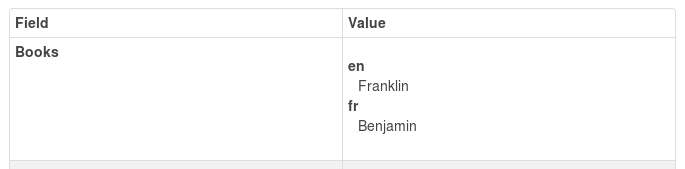

ckanext-fluent
==============

This extension provides a way to store and return multilingul
fields in CKAN datasets, resources, organizations and groups.

Add the `fluent` plugin to your ckan.plugins configuration
settings and use ckanext-scheming or a custom form plugin to
use the provided validators to store multilingual text in
extra fields.

The easiest way to use fluent multilingual text fields is with
[ckanext-scheming](https://github.com/open-data/ckanext-scheming/).
A fluent multilingual field in a scheming schema
will look something like::

```json
{
  "field_name": "books",
  "form_snippet": "fluent_text.html",
  "display_snippet": "fluent_text.html",
  "label": {
    "en": "Books",
    "fr": "Livres"
  },
  "validators": "fluent_text",
  "output_validators": "fluent_text_output",
  "form_languages": ["en", "fr"]
}
```

This new extra field "books" will appear as multiple fields in the
dataset form, one for each language specified in `form_languages`
by the [form snippet](ckanext/fluent/templates/scheming/form_snippets/fluent_text.html).


When displayed, each language with text entered will appear separately
by the
[display snippet](ckanext/fluent/templates/scheming/display_snippets/fluent_text.html), eg.:



When the dataset is accessed from the API the language values appear
and are updated as an object, eg.:

```json
{
  "...": "..."
  "books": {
    "en": "Franklin",
    "fr": "Benjamin"
  },
  "...": "..."
}
